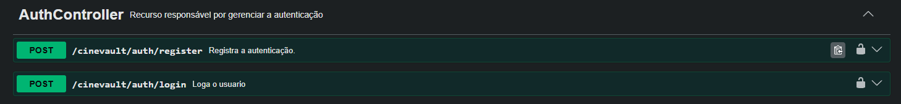
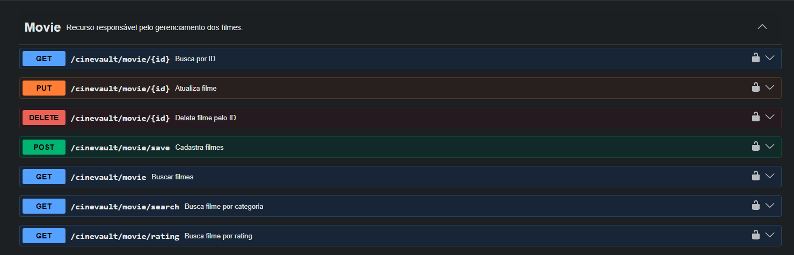
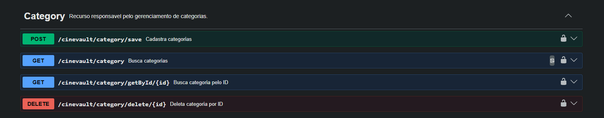
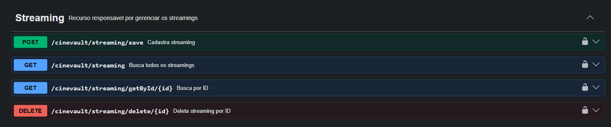

<h1 align="center">
🎬 CineVault
</h1>

<p align="center">
A secure REST API for managing a movie catalog built with Java, Spring Boot and PostgreSQL.
</p>

<p align="center">


</p>

---

# 📖 About

**CineVault** is a REST API designed to manage a movie catalog.

The application allows users to register, authenticate and securely access protected endpoints using **JWT Authentication**. It also provides complete CRUD operations for movies and streaming platforms.

The project follows Spring Boot best practices, applying a layered architecture to keep the code organized, maintainable and scalable.

---

# ✨ Features

- 🔐 User Registration
- 🔑 JWT Authentication
- 🎬 Complete Movie CRUD
- 📺 Streaming CRUD
- 🎭 Search movies by category
- ⭐ Search movies by rating
- 🛡️ Protected endpoints with Spring Security
- 📖 Interactive API documentation with Swagger
- 🗄️ Database versioning using Flyway

---

# 🛠️ Technologies

| Technology | Purpose |
|------------|---------|
| Java 21 | Programming Language |
| Spring Boot | Backend Framework |
| Spring Security | Authentication & Authorization |
| JWT | Secure Authentication |
| Spring Data JPA | Data Persistence |
| PostgreSQL | Relational Database |
| Flyway | Database Migrations |
| Swagger / OpenAPI | API Documentation |
| Maven | Dependency Management |
| Lombok | Boilerplate Reduction |

---

# 🏗️ Architecture

```
                Client
                   │
                   ▼
        Spring Security (JWT)
                   │
                   ▼
             REST Controller
                   │
                   ▼
                Service
                   │
                   ▼
              Repository
                   │
                   ▼
              PostgreSQL
```

---

# 📷 API Documentation

The API is fully documented using Swagger/OpenAPI.

---

## Authentication

<p align="center">
    
</p>

---

## Movie Endpoints

<p align="center">
    
</p>

---

## Category Endpoint

<p align="center">
    
</p>

---

## Streaming Endpoints

<p align="center">
    
</p>

---

# 🔐 Authentication

Authentication is performed using **JWT (JSON Web Token).**

### Register

Create a new account using:

- Name
- Email
- Password

### Login

Authenticate using:

- Email
- Password

The API returns a JWT token.

Example:

```json
{
    "token":"eyJhbGc..."
}
```

Every protected endpoint requires:

```
Authorization: Bearer YOUR_TOKEN
```

---

# 🚀 Running the Project

## Clone the repository

```bash
git clone https://github.com/Kayosouza1/CIneVault.git
```

## Enter the project folder

```bash
cd CIneVault
```

## Configure PostgreSQL

Update your database credentials inside:

```
application.yml
```

## Run the application

```bash
mvn spring-boot:run
```

The application will start at

```
http://localhost:8080
```

Swagger

```
http://localhost:8080/swagger/swagger-ui/index.html
```

---

# 📌 Main Endpoints

| Method | Endpoint | Description |
|---------|----------|-------------|
| POST | `/auth/register` | Register a new user |
| POST | `/auth/login` | Authenticate and receive JWT |
| GET | `/movie` | List all movies |
| GET | `/movie/{id}` | Find movie by ID |
| GET | `/movie/category/{category}` | Search movies by category |
| GET | `/movie/rating` | Search movies by rating |
| POST | `/movie/save` | Create a movie |
| PUT | `/movie/update/{id}` | Update a movie |
| DELETE | `/movie/delete/{id}` | Delete a movie |
| GET | `/streaming` | List all streaming platforms |
| POST | `/streaming/save` | Create a streaming platform |
| DELETE | `/streaming/delete/{id}` | Delete a streaming platform |

---

# 💾 Database

The project uses **PostgreSQL** as its relational database.

Database schema versioning is managed with **Flyway**, allowing migrations to be executed automatically whenever the application starts.

---

# 📂 Project Structure

```
src
 ├── config
 ├── controller
 ├── dto
 ├── entity
 ├── repository
 ├── security
 ├── service
 ├── validation
 └── resources
```

---

# 👨‍💻 Author

## Kayo Souza

Backend Developer passionate about Java and Spring Boot.

GitHub

https://github.com/Kayosouza1

LinkedIn

https://www.linkedin.com/in/kayo-souza-20808936a/

---

<p align="center">

⭐ If you liked this project, consider giving it a star.

</p>